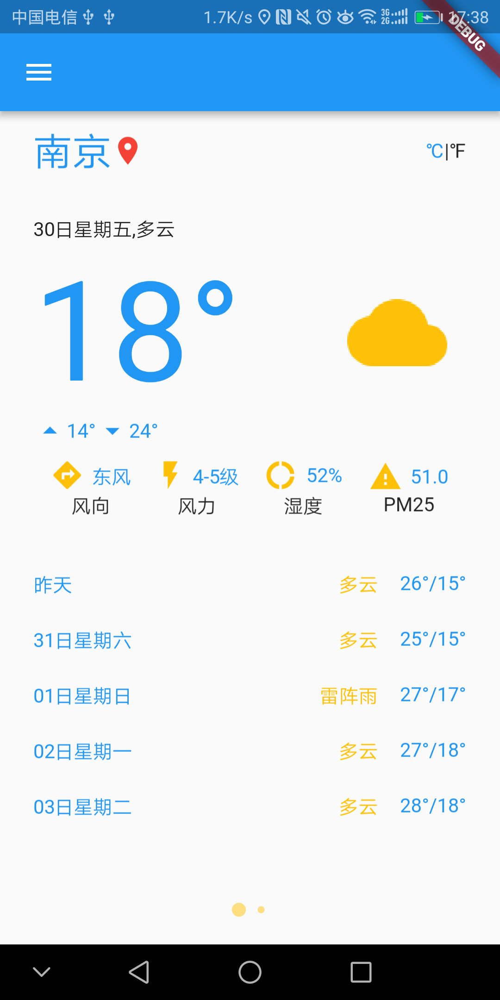

# flutter_app_four

A new Flutter application.

## 说明

PageView.custom添加布局，animateToPage指定页面;  
ListView布局;  
Image，Icon,Text控件 
GestureDetector点击事件;RefreshIndicator下拉刷新 
Route跳转 
UserAccountsDrawerHeader 抽屉布局的用户布局 
CircleAvatar 圆形头像图标 

3libs:  shared_preferences操作本地缓存， http网络请求， json_annotation转换， intl日期转换, location定位 
share分享 
flutter_webview_plugin打开webview 
package_info应用信息
  功能：  
展示昨天今天及未来4天天气，温度； 支持℉/℃转换 

##记录 
##2018年3月28日 
添加Drawer抽屉布局 
GPS定位经纬度，google api获取地点描述 
##2018年3月29日 
添加分享功能； 
添加列表 
修改抽屉布局 
Pageview圆点引导 
版本描述 
天气缓存 

##2018年3月30日 
添加地点搜索功能，结果保存，并获取选择地点的天气; 
允许添加新地点，删除本地存储的地点； 
首页PageView功能优化：使用PageView.custom方法 
城市当前位置标识 

##2018年4月2日 
返回首页数据刷新操作实现；调整首页添加布局 
当前位置城市标识及位置失效标识 
列表指定跳转城市 

##2018年4月3日 
添加lottie动画(三方包有问题) 
打开网页 

#问题 
无

app:https://fir.im/LiveWeathe

